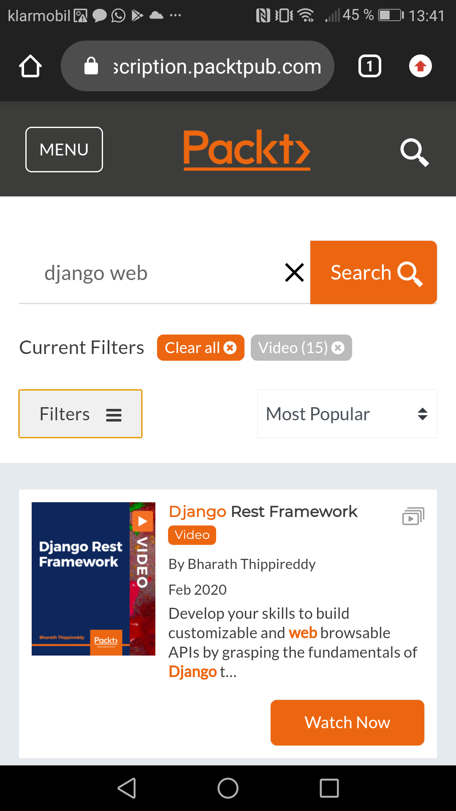

# Filter Menu

## Requirements

- Ein- und ausklappbares Filter Menü
- Anzeige,  in der ausgewählte Filter angezeigt werden
- Möglichkeit Filter zurücksetzen
    - Selektiv über 'X' in Filteranzeige
    - Zurücksetzen aller Filter über einzelnen Button
- Mehrfachauswahl bei Filter mit mehreren Kategorien

Examples (Screens)

django-filter: https://sodocumentation.net/de/django/topic/6101/django-filter

Create filter Menu with django-filter
https://simpleisbetterthancomplex.com/tutorial/2016/11/28/how-to-filter-querysets-dynamically.html

Customize filter
https://django-filter.readthedocs.io/en/stable/ref/filters.html#modelmultiplechoicefilter

Keyword-only arguments
Model Multiple Choice Filter
https://django-filter.readthedocs.io/en/stable/ref/filters.html#modelmultiplechoicefilter

Crispy Forms
https://spapas.github.io/2020/03/18/django-crispy-form-quick-easy-layout/
https://simpleisbetterthancomplex.com/tutorial/2018/11/28/advanced-form-rendering-with-django-crispy-forms.html

Filter by multiple selected options
https://www.iditect.com/how-to/56897321.html

Filter Records by multiple Fields
https://www.google.com/search?client=ms-android-huawei&tbm=vid&sxsrf=ALeKk00guxMuE4_I1YTJINi1EfN7l00EHQ:1608914541096&q=django+form+filter&sa=X&ved=2ahUKEwjmnMjdyentAhXQhqQKHVMkDf8Q8ccDKAR6BAgpEC0&biw=360&bih=580&dpr=3#

Multiple Model Search
https://www.codingforentrepreneurs.com/blog/a-multiple-model-django-search-engine